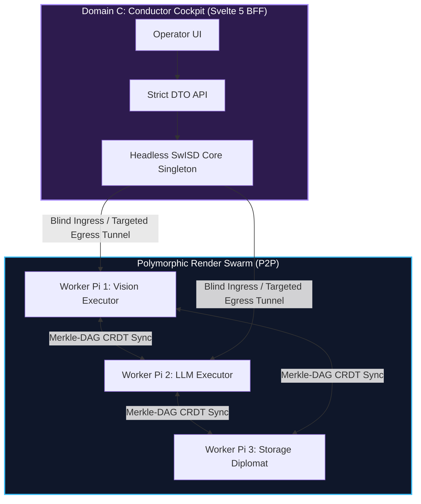

# SwISD: Decentralized AI Render Swarm


[](https://github.com/hideosnes/SwISD/actions)
[](https://www.npmjs.com/package/swisd)
[](https://opensource.org/licenses/MPL-2.0)
[](https://codecov.io/gh/hideosnes/SwISD)

> **AI Inference On Your Terms.**  
> Insanely resource-efficient, decentralized, and capability-aware.  
> [Learn more at swisd.at](https://swisd.at)

SwISD is a decentralized, agentoid P2P network for distributed AI inference. Built for open-source degenerates and AI researchers who refuse to be bottlenecked by centralized compute monopolies. It operates without central coordinators or databases, relying on neighborhood propagation, dynamic swarm specialization, and torrent-like workload sharing. Resilience, cryptographic correctness, and resource efficiency are not features—they are the absolute highest priorities.

---

## 🏗 Architecture at a Glance

*(Note: High-fidelity architecture diagrams and GIFs are incoming. For now, behold the Mermaid truth.)*



---

## The Deep Dive

### 1. The Polymorphic Render Swarm
SwISD is capability-aware. The ingress is blind, the egress is a targeted tunnel, the agents are beautifully dumb (stateless), and the ingestion is so polite it adapts polymorphically to both Node.js and Browser inputs via strict `AsyncIterable<Uint8Array>` pipelines. Peers advertise their `supportedExecutors` in the Control Ledger. The swarm routes `ExecutionPayload` chunks *only* to peers that explicitly advertise the required capability, preventing wasted cycles on incompatible hardware.

### 2. Merkle-DAG CRDTs (No Central Database)
We do not rely on fragile central databases. SwISD utilizes custom, Merkle-DAG structured Conflict-free Replicated Data Types (CRDTs) for eventual consistency. 
- **Control Ledger**: Fully replicated across all peers. Contains CRDT metadata (membership, capabilities, reputation logs). 
- **Read-Time Reputation Decay**: We never mutate state at write-time (which violates CRDT inflationary laws). Instead, we store an append-only G-Set of signed events and project the decayed reputation score purely at read-time. Convergence is mathematically guaranteed.
- **Anti-Entropy Sync**: Reconnecting peers exchange Merkle root hashes. If they differ, they recursively descend and fetch *only* the missing or modified branches, dropping bandwidth from O(n) to O(d · log n).

### 3. Domain C: The Conductor Cockpit
The operator-facing control surface is a separate architectural domain. It observes, provisions, and directs through the same strict capability contracts used by the swarm. 
- Built with **Svelte 5 (Runes/Snippets)**, SvelteKit 2 Node adapter, and TailwindCSS v4.
- The SvelteKit server acts as the Backend-for-Frontend (BFF) and is the *only* process allowed to touch the headless SwISD core. 
- **Zero-Compromise Type Safety**: The codebase enforces `strictNullChecks`, `noImplicitAny`, and build-failing `eslint-plugin-no-any`. There is no `any` in SwISD. Ever. Unknown network failures are rigorously narrowed from `unknown`.

---

## Quick Start

SwISD is designed to be spun up with minimal friction. 

### Prerequisites
- **Node.js**: v22.x or higher (ESM strict mode).
- **Package Manager**: `npm` (v10.x or higher).
- *Note: No external database or complex environment variables are required for local development.*

### Installation & Development

1. Clone the repository:
   ```bash
   git clone https://github.com/hideosnes/SwISD.git
   cd SwISD
   ```

2. Install dependencies:
   ```bash
   npm install
   ```

3. Start the Conductor Cockpit and headless core in development mode:
   ```bash
   npm run dev
   ```

4. Open your browser to `http://localhost:5173` to access the Conductor Cockpit.

## 🤝 Community & Contributing

SwISD is a living, breathing organism. 
- **Feature Requests**: We are currently prioritizing organizational partnerships. If your organization has specific, high-value use cases or feature ideas, we want to hear them. 
- **Code Contributions**: Direct coding contributions are warmly welcomed as soon as our public versioning and contribution guidelines stabilize. Watch this space.
- **Support & Discussion**: All technical questions, architectural debates, and swarm troubleshooting belong in [GitHub Discussions](https://github.com/hideosnes/SwISD/discussions). Do not open issues for general questions.

Please read our [Code of Conduct](./CODE_OF_CONDUCT.md) before participating. We build fierce tech, but we demand fierce respect.

---

## 📜 License

This project is licensed under the **Mozilla Public License 2.0 (MPL-2.0)**.  
See the [LICENSE](./LICENSE) file for the full legal text.  
*Copyright (c) 2026 Homahuki GmbH.*

TODO:
- badges
- Getting Started & Cockpit